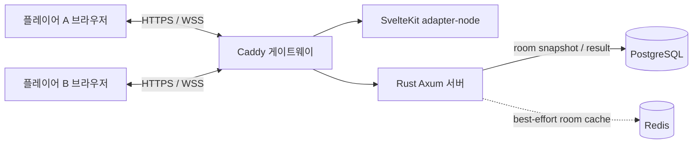

# Mk.01 — Naval Battle Board Game


`Mk.01-GameProject-NavalBattleBoardGame`은 두 명의 플레이어가 각자의 10×10 해역에 함선을 비공개로 배치하고, WebSocket으로 턴을 교대하며 상대 함대를 먼저 격침하는 실시간 전략 게임입니다. 함선 좌표, 공격 판정, 턴, 승패는 Rust 서버만 관리하며 상대 함선 좌표는 클라이언트로 전송하지 않습니다.

## 제공 기능

- 안전한 익명 게스트 세션, 공개·비공개 방, 6자리 방 코드와 초대 링크
- 실시간 로비, 빠른 매칭, 참가·준비·배치·턴·결과 동기화
- 드래그 앤 드롭, 클릭/터치, `R` 회전, 자동 배치, 초기화가 가능한 함대 배치기
- 서버 권위형 규칙 검증, 턴/버전 순서 검증, UUID 요청 멱등성
- 새로고침 복구, 지수 백오프 재연결, 재접속 유예 시간과 자동 기권승 처리
- 서버 검증형 기권과 `Normal Victory`/`Surrender`/`Disconnect` 승리 원인 기록
- 게임 시작 전 서버 승인형 준비 취소와 함대 재편집, 요청 UUID 기반 멱등 처리
- 방 단위 실시간 전술 채팅, 타입화된 빠른 명령·Unicode 이모지, 입력 중 표시, 최근 100개 메시지 복구
- 서버 UTC 기준 전체 작전 시간과 턴 마감, 시간 초과 턴 자동 교대와 3회 연속 초과 자동 패배
- `NORMAL`/`SURRENDER`/`DISCONNECT`/`TIMEOUT` 종료 원인과 시간 초과 통계 기록
- 재경기, 승패·명중률·턴·플레이 시간 통계, 전투 기록
- 데스크톱 2보드 레이아웃과 모바일 탭 전환, 키보드 조작, 고대비/모션 감소, 사운드 설정
- PostgreSQL 영속화, Redis 읽기 캐시, 구조화 JSON 로그, Docker Compose 운영 구성

## 게임 규칙

세로축은 A–J, 가로축은 1–10입니다. 각 플레이어는 항공모함 5칸, 전함 4칸, 순양함 3칸, 잠수함 3칸, 구축함 2칸을 가로 또는 세로로 겹치지 않게 배치합니다. 두 플레이어가 모두 배치를 확정하면 서버가 선공을 무작위로 선택합니다.

한 턴에 좌표 하나만 공격할 수 있고, 이미 공격한 좌표는 다시 선택할 수 없습니다. 결과는 `MISS`, `HIT`, `SUNK`로 구분됩니다. 모든 함선의 17칸을 먼저 명중시킨 플레이어가 승리합니다.

기본 턴 제한은 60초입니다. 마감까지 공격하지 않으면 공격 없이 상대 턴으로 넘어가며, 같은 플레이어가 3회 연속으로 시간을 초과하면 `TIMEOUT` 패배가 확정됩니다. 정상 공격을 수행하면 해당 플레이어의 연속 초과 횟수는 0으로 초기화됩니다. 먼저 준비를 확정한 플레이어는 상대의 최종 확정으로 게임이 시작되기 전까지만 준비를 취소하고 배치를 다시 편집할 수 있습니다.

## 기술 스택

| 영역          | 기술                                                      |
| ------------- | --------------------------------------------------------- |
| 프런트엔드    | SvelteKit 2, Svelte 5, TypeScript 6, CSS 디자인 토큰      |
| API/게임 서버 | Rust 1.87, Axum 0.8, Tokio                                |
| 실시간        | WebSocket, 타입화 JSON 이벤트                             |
| 저장소        | PostgreSQL 17, SQLx migration, Redis 7.4                  |
| 테스트        | Rust unit/integration, Vitest, Playwright Chromium/WebKit |
| 운영          | adapter-node, Docker Compose, Caddy                       |

## 시스템 아키텍처



브라우저는 자신의 배치/보드와 자신이 실행한 공격 결과만 받습니다. `GameRoom` 내부 스냅샷은 최근 채팅 100개를 포함해 PostgreSQL JSONB에 원자적으로 저장되고 Redis는 1시간 읽기 캐시로만 사용됩니다. Redis가 중단되어도 PostgreSQL로 게임을 계속할 수 있습니다. 채팅 추가는 공격용 게임 버전을 변경하지 않아 동시에 도착한 사격 요청과 충돌하지 않습니다.

상태 머신은 다음 전이만 허용합니다.

```text
WAITING → PLACEMENT ⇄ READY → PLAYING → FINISHED
    └──→ CANCELLED      ↑          ↓
PLACEMENT → CANCELLED      └─ DISCONNECTED ─┘
FINISHED → PLACEMENT  (두 명 모두 재경기 동의)
```

`READY`는 배치 확정 상태를 표현합니다. 시작 확정 전 `player:unready`가 승인되면 `PLACEMENT`로 돌아가며, 두 번째 확정과 시작 판정은 방 단위 잠금 안에서 원자적으로 수행되므로 시작 이후 취소가 끼어들 수 없습니다.

## 디렉터리 구조

```text
apps/
  server/                 Rust API·WebSocket·도메인·저장소
    migrations/           PostgreSQL SQLx 마이그레이션
    src/domain/           보드, 함선, 턴, 방 상태 머신
    src/store/            Memory / PostgreSQL+Redis 저장소
    tests/                HTTP 통합 테스트
  web/                    SvelteKit 웹 클라이언트
    src/lib/components/   배치·전투·결과 컴포넌트
    src/routes/           시작, 로비, 참가, 방, 기록, 설정, 오류
    e2e/                  2-브라우저 전체 경기·모바일 테스트
deploy/Caddyfile          로컬 Compose 게이트웨이
compose.yaml              PostgreSQL, Redis, server, web, gateway
```

## 로컬 실행

### 1. 빠른 개발 모드

필요 도구는 Rust 1.87 이상, Node.js 22 이상, npm 11 이상입니다.

```bash
cp .env.example .env
npm install
npm run dev
```

`http://localhost:5173`에 접속합니다. 기본 `STORAGE_MODE=memory`는 DB 없이 즉시 실행하기 위한 개발 모드이며 서버 종료 시 데이터가 사라집니다.

### 2. 영속 로컬 스택

Docker Compose 2 또는 호환되는 Podman Compose가 필요합니다.

```bash
POSTGRES_PASSWORD='replace-this-local-password' docker compose up --build
```

`http://localhost:8088`에 접속합니다. PostgreSQL과 Redis 데이터는 각각 named volume에 보존됩니다. SQLx 마이그레이션은 Rust 서버 시작 시 자동 적용됩니다.

## 환경 변수

| 변수                      | 기본값                    | 설명                                          |
| ------------------------- | ------------------------- | --------------------------------------------- |
| `SERVER_HOST`             | `0.0.0.0`                 | Rust 서버 바인드 주소                         |
| `SERVER_PORT`             | `8080`                    | Rust 서버 포트                                |
| `STORAGE_MODE`            | `memory`                  | `memory` 또는 `postgres`                      |
| `DATABASE_URL`            | 예제 참조                 | PostgreSQL 접속 URL                           |
| `REDIS_URL`               | `redis://localhost:6379/` | Redis 접속 URL                                |
| `PUBLIC_BASE_URL`         | `http://localhost:5173`   | 초대 URL에 쓰이는 공개 주소                   |
| `ALLOWED_ORIGINS`         | localhost 2개             | 쉼표로 구분한 CORS/WebSocket Origin 허용 목록 |
| `SECURE_COOKIES`          | `false`                   | HTTPS 운영에서는 반드시 `true`                |
| `SESSION_TTL_SECONDS`     | `2592000`                 | 게스트 세션 유효 기간                         |
| `RECONNECT_GRACE_SECONDS` | `90`                      | 재접속 유예 시간                              |
| `TURN_DURATION_SECONDS`   | `60`                      | 턴 제한(초), `0`이면 제한 없음                |
| `RUST_LOG`                | info                      | `tracing` 로그 필터                           |

## REST API

모든 경로의 prefix는 `/api`입니다. 세션 생성 후 발급된 `mk01_session` HttpOnly 쿠키를 사용하며 JSON에 토큰을 반환하지 않습니다.

| Method        | 경로                    | 기능                                     |
| ------------- | ----------------------- | ---------------------------------------- |
| `GET`         | `/health`               | 프로세스/저장 모드 헬스                  |
| `POST`        | `/sessions`             | 닉네임 검증 후 게스트 세션 생성          |
| `GET`         | `/sessions/current`     | 현재 세션 복구                           |
| `GET/POST`    | `/rooms`                | 공개 방 목록 / 방 생성                   |
| `POST`        | `/rooms/join`           | 방 코드로 참가                           |
| `GET`         | `/rooms/{roomId}`       | 본인 기준 비공개 필터 스냅샷             |
| `POST`        | `/rooms/{roomId}/leave` | 전투 전 방 나가기 또는 전투 중 이탈 처리 |
| `GET`         | `/games/recover`        | 진행 중 게임 복구                        |
| `GET`         | `/games/history`        | 최근 50개 경기 결과                      |
| `POST/DELETE` | `/matchmaking`          | 빠른 매칭 대기/취소                      |

오류는 `{ code, message, requestId }` 형태의 안전한 JSON으로 반환됩니다. 잘못된 JSON·UUID도 내부 파서 정보 대신 `INVALID_REQUEST`로 일관되게 처리합니다.

## WebSocket 이벤트 계약

연결 경로는 `/ws`이며 쿠키 세션과 `Origin` 허용 목록을 모두 검증합니다. 공통 envelope는 다음과 같습니다.

```json
{
  "type": "attack:fire",
  "payload": {
    "requestId": "uuid",
    "roomId": "uuid",
    "playerId": "uuid",
    "coordinate": { "row": 0, "col": 0 },
    "expectedVersion": 12,
    "turnNumber": 4
  }
}
```

| 클라이언트 이벤트 | 핵심 payload                                                                     |
| ----------------- | -------------------------------------------------------------------------------- |
| `room:create`     | `name`, `visibility`                                                             |
| `room:join`       | `code`                                                                           |
| `room:leave`      | `roomId`                                                                         |
| `player:ready`    | `roomId`, `playerId`, `ready`                                                    |
| `ships:place`     | `roomId`, `playerId`, `placements[]`                                             |
| `ships:confirm`   | `roomId`, `playerId`, `placements[]`                                             |
| `player:unready`  | `requestId`, `roomId`, `playerId`                                                |
| `attack:fire`     | `requestId`, `roomId`, `playerId`, `coordinate`, `expectedVersion`, `turnNumber` |
| `game:surrender`  | `roomId`, `playerId`                                                             |
| `chat:send`       | `roomId`, `clientMessageId`, `type`, `content`, `commandId`                      |
| `chat:typing`     | `roomId`, `isTyping`                                                             |
| `game:rematch`    | `roomId`                                                                         |
| `game:sync`       | `roomId`                                                                         |
| `heartbeat`       | `clientTime`                                                                     |

| 서버 이벤트                                 | 용도                                            |
| ------------------------------------------- | ----------------------------------------------- |
| `room:created`, `room:updated`              | 방 생성/상태 갱신                               |
| `player:joined`, `player:left`              | 참가자 변경                                     |
| `placement:accepted`, `placement:rejected`  | 배치 검증 결과                                  |
| `player:unready:accepted/rejected`          | 준비 취소 승인/거절과 요청 멱등 결과            |
| `game:started`, `turn:started/changed`      | 선공/턴과 UTC 마감 시각 동기화                  |
| `turn:expired`, `game:timer-sync`           | 시간 초과 판정과 재접속 타이머 보정             |
| `attack:result`, `ship:sunk`                | 공격·격침 결과                                  |
| `game:finished`                             | 승패와 통계                                     |
| `game:surrendered`                          | 기권자·승자·서버 판정 시각                      |
| `chat:message`                              | 플레이어 또는 `SYSTEM` 작전 메시지              |
| `chat:history`                              | 방의 최근 메시지 최대 100개                     |
| `chat:typing`                               | 상대 지휘관 입력 상태(비영속)                   |
| `chat:rejected`                             | 메시지 타입·허용 목록·속도 제한 거절            |
| `player:disconnected`, `player:reconnected` | 연결 상태                                       |
| `game:snapshot`                             | 세션별 전체 공개 상태                           |
| `heartbeat`                                 | 연결 생존 확인                                  |
| `error`                                     | `code`, 사용자 메시지, `retryable`, `requestId` |

`row`/`col`은 0–9입니다. `ships:place`는 항공모함·전함·순양함·잠수함·구축함을 각각 한 번씩 정확히 포함해야 합니다. 확정 시 같은 배치를 다시 보내며 서버 저장본과 일치해야 합니다. 서버는 세션으로 실제 `playerId`를 다시 확인하며, 공격·준비 취소·채팅 UUID가 중복되면 기존 결과만 재전송합니다. 공격은 현재 `turnNumber`와 서버 마감 시각을 모두 통과해야 합니다.

채팅 `type`은 클라이언트가 보낼 수 있는 `TEXT`, `QUICK_COMMAND`, `EMOJI`와 서버 전용 `SYSTEM`으로 나뉩니다. 빠른 명령은 `GOOD_GAME`, `WAIT_A_MOMENT`, `READY`, `NICE_SHOT`, `LUCKY`, `GO_FIRST`, `REMATCH`, `THANK_YOU` ID만 허용하고 표시 문구는 서버가 결정합니다. 이모지는 저장소의 공유 허용 목록에 있는 Unicode 값만 받습니다. `chat:send`와 `chat:typing`은 현재 방 멤버에게만 전달됩니다.

`turn:started`, `turn:changed`, `game:timer-sync`는 `gameId`, `turnNumber`, `activePlayerId`, `gameStartedAt`, `turnStartedAt`, `turnDeadlineAt`, `turnDurationSeconds`, `serverTimestamp`를 제공합니다. 클라이언트는 절대 마감 시각과 서버 시각 오차로 화면만 계산하며, 만료와 승패는 서버 스케줄러만 확정합니다.

## 재접속과 게임 복구 정책

- WebSocket이 끊기면 방은 `DISCONNECTED`로 전이하고 기존 상태와 절대 마감 시각을 저장합니다.
- 클라이언트는 0.6–10초 지수 백오프로 재연결하고, 연결 즉시 `game:sync`로 자신에게 허용된 스냅샷과 `chat:history`를 받습니다.
- 기본 90초 안에 같은 HttpOnly 세션으로 복귀하면 이전 `WAITING`/`PLACEMENT`/`PLAYING` 상태를 복원합니다.
- 전투 중 마감 시각이 지나면 온라인 상대의 기권승, 전투 전이면 `CANCELLED`로 처리합니다.
- 서버 재시작 시 활성 방, 재접속 마감, `turnDeadlineAt`을 PostgreSQL JSONB에서 다시 불러옵니다. 이미 지난 턴은 턴 번호·활성 플레이어·마감 키를 대조해 한 번만 즉시 만료 처리합니다.

## 보안 설계

- 256-bit 무작위 게스트 토큰을 HttpOnly, SameSite=Lax 쿠키로 전달하고 SHA-256 해시만 저장합니다.
- WebSocket upgrade의 `Origin`을 명시적 허용 목록으로 검증해 cross-site WebSocket hijacking을 차단합니다.
- JSON은 알 수 없는 필드를 거부하고 본문/프레임을 64 KiB로 제한합니다.
- 채팅은 HTML 구분자·제어 문자를 거부하고 Svelte 텍스트 바인딩으로만 렌더링합니다. 일반 텍스트는 300자로 제한하며 이모지·빠른 명령도 포함해 플레이어별 2초당 3회, 10초당 8회 제한과 3초 차단을 적용합니다. 같은 빠른 명령의 2초 이내 반복도 거부합니다.
- 배치, 턴, 공격, 격침, 승패, 요청 순서를 모두 서버에서 재검증합니다.
- 클라이언트 스냅샷은 세션별로 생성되며 상대 `Board`, 함선 좌표, 세션 ID/토큰을 포함하지 않습니다.
- DB/Redis 오류는 구조화 로그에만 원인을 남기고, 클라이언트에는 안전한 오류 코드와 추적 UUID만 보냅니다.
- E2E는 모든 수신 WebSocket 프레임을 감사해 `targetBoard.ships`/`sessionId`가 없음을 확인합니다.

취약점 제보 절차는 [SECURITY.md](SECURITY.md)를 참조하세요.

## 테스트와 품질 검사

```bash
npm run check       # Rust check + Svelte/TypeScript check
npm run lint        # rustfmt + clippy -D warnings + Prettier + ESLint
npm run test        # Rust unit/integration + Vitest
npx playwright install chromium webkit
npm run test:e2e    # 독립 브라우저 2개의 전체 경기 + 모바일
npm run build       # Rust release + SvelteKit adapter-node
```

Rust 테스트는 배치, 준비 취소 멱등성·시작 경쟁, 명중/격침, 오래된 턴, 공격/만료 경쟁, 3회 만료 패배, 정상 공격 후 연속 횟수 초기화, 재시작 만료 복구, 타입별 채팅 허용 목록·XSS·속도 제한·100개 보존, 재접속, JSON 영속화, 클라이언트 정보 비공개를 검증합니다. Playwright는 두 브라우저의 전체 경기와 별도로 준비 취소→재배치→빠른 명령/이모지→정상 공격→새로고침→3회 만료 `TIMEOUT` 결과를 검증합니다.

## 프로덕션 빌드·배포

```bash
npm ci
npm run build
STORAGE_MODE=postgres DATABASE_URL='postgres://...' REDIS_URL='redis://...' \
  PUBLIC_BASE_URL='https://game.example.com' \
  ALLOWED_ORIGINS='https://game.example.com' SECURE_COOKIES=true \
  ./target/release/mk01-server

HOST=0.0.0.0 PORT=3000 ORIGIN='https://game.example.com' node apps/web/build
```

운영에서는 API와 웹을 같은 HTTPS origin으로 reverse proxy하고 `/api/*`, `/ws`를 Rust 서버로 전달하세요. TLS 종단, 영속 볼륨, PostgreSQL 백업, 로그 수집, 헬스체크를 활성화해야 합니다. 제공된 `compose.yaml`과 `deploy/Caddyfile`은 로컬/단일 호스트 기준이므로 공개 도메인에서는 `PUBLIC_BASE_URL`, `ALLOWED_ORIGINS`, `ORIGIN`, Caddy 주소, 80/443 포트를 해당 도메인으로 변경하세요.

## 알려진 제한

- 빠른 매칭 큐와 WebSocket 연결 허브는 현재 서버 프로세스 내부에 있습니다. 현 배포는 Rust 서버 1개 replica를 기준으로 하며, 수평 확장 시 Redis Pub/Sub 또는 별도 실시간 게이트웨이가 필요합니다.
- 턴 만료 스케줄러도 현재 단일 Rust 서버의 방 잠금과 영속 마감 키를 기준으로 합니다. 다중 replica 배포 전에는 Redis 분산 락/작업 큐로 동일한 `(roomId, turnNumber, activePlayerId, deadline)` 소유권을 조정해야 합니다.
- 게스트 세션은 디바이스 간 계정 동기화를 제공하지 않습니다. 브라우저 쿠키를 삭제하면 기존 게스트 기록에 다시 접근할 수 없습니다.
- SvelteKit 2.70.2의 안정화 버전은 `cookie@0.6` 의존성에 대한 low-severity 이름/경로 문자 검증 권고를 남깁니다. 이 앱은 사용자 입력으로 SvelteKit 쿠키 이름·경로를 생성하지 않고, 인증 쿠키는 Rust의 고정 이름 `mk01_session`으로만 발급합니다. SvelteKit 3 안정화 후 업그레이드를 권장합니다.

## 라이선스

[MIT](LICENSE)
