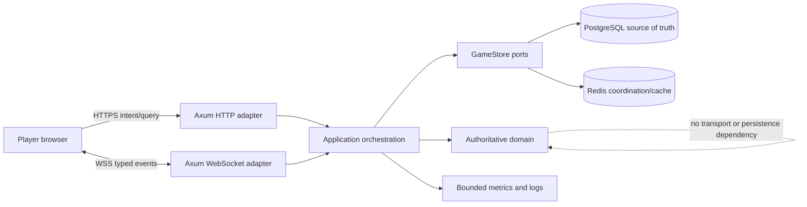

# Mk.01 Architecture and Ownership

This document is the reviewed architecture map for Mk.01. It defines where authority lives, which
dependency directions are allowed, who owns each boundary, when an ADR is mandatory, and which
known decomposition work remains open. `.github/architecture-ownership.json` is the machine-readable
source for paths and roles; `.github/CODEOWNERS` maps those paths to the current accountable GitHub
reviewer.

## System context and authority



The browser sends intent and renders personalized projections. It never decides placement validity,
turn order, hit/sink/win results, timers, rewards, matchmaking eligibility, rating, moderation, or
hidden-state visibility. The Rust domain owns those decisions. Application orchestration authenticates
the session, invokes the domain, persists with revision/fencing guarantees, then publishes a
personalized event. PostgreSQL is durable authority. Redis provides shared limits, fan-out, leases,
and cache acceleration but cannot make a stale room write authoritative.

## Dependency direction

```text
web routes/components
        ↓
browser API/realtime/protocol adapters
        ↓ HTTPS/WSS
server API/WS/protocol adapters
        ↓
application orchestration (AppState use cases, timers, fan-out, metrics)
       ↙ ↘
domain rules   store ports/adapters → PostgreSQL / Redis
```

These rules are release invariants:

1. `apps/server/src/domain` may depend on shared errors and other domain modules, never API, WebSocket,
   application orchestration, protocol DTOs, or storage adapters.
2. `apps/server/src/store` implements durable ports using domain values and shared errors; it never
   calls HTTP, WebSocket, or application handlers.
3. API and WebSocket modules translate transport data and delegate use cases. They do not duplicate
   rules that belong to the domain.
4. Browser game algorithms under `src/lib/game` remain pure and may consume public types, but cannot
   call API, realtime, global stores, routes, or presentation components.
5. Cross-instance delivery never bypasses personalized snapshot filtering or negotiated protocol
   adaptation. A cache/pub-sub failure cannot grant write authority.
6. Dependency direction, authority ownership, public compatibility, consistency, or production
   security/SLO changes require an ADR rather than an unexplained code comment.

`npm run architecture:check` scans the protected source sets for forbidden reverse dependencies and
fails when a critical repository file has no exactly-one ownership boundary.

## Owned boundaries

| Boundary ID                    | Accountable role      | Paths                                                                | Owns                                                                                     | Required review                                                         |
| ------------------------------ | --------------------- | -------------------------------------------------------------------- | ---------------------------------------------------------------------------------------- | ----------------------------------------------------------------------- |
| `authoritative-gameplay`       | `game-integrity`      | `apps/server/src/domain/`                                            | Rules, state machines, hidden state, balance interpretation, progression, safety         | `service-platform`; hidden-state changes also need independent approval |
| `service-orchestration`        | `service-platform`    | server API/app/config/protocol/WS/runtime files and HTTP integration | Authentication flow, use cases, timers, transport, rate limits, fan-out, bounded signals | `game-integrity`                                                        |
| `persistence-and-coordination` | `data-reliability`    | store adapters, migrations, distributed tests                        | PostgreSQL authority, Redis coordination, privacy deletion, backup/restore compatibility | `service-platform` and `game-integrity`                                 |
| `web-client`                   | `web-experience`      | `apps/web/`                                                          | Routes, state, components, accessibility, responsive behavior, browser validation        | `game-integrity` and `service-platform` for state/contract changes      |
| `public-contracts`             | `service-platform`    | `contracts/`                                                         | Frozen manifests, client fixtures, checksums, release window evidence                    | `web-experience` and `game-integrity`                                   |
| `architecture-governance`      | `architecture`        | `docs/`                                                              | Architecture, ADRs, operating policies, reviews, readiness evidence                      | Affected boundary roles                                                 |
| `quality-and-delivery`         | `release-engineering` | CI, tools, config, deploy, ops, scripts, manifests                   | Reproducible gates, artifacts, rollout configuration, operational validation             | `architecture` and `service-platform`                                   |

The current repository has one accountable GitHub reviewer, `@667700996`, holding these explicit
roles. Role ownership remains separate so responsibilities and escalation do not collapse into file
location. Production changes in the high-risk classes listed in the ownership manifest require an
independent approval; the single-maintainer mapping is not a waiver. Adding maintainers means changing
the role accounts and CODEOWNERS together, with a reviewed ownership record.

## Runtime flows

### Authoritative command

1. HTTP/WS validates origin, protocol, size/rate limits, and session.
2. Application orchestration loads the authoritative room and obtains the local serialization guard.
3. The domain validates intent against player binding, pinned rules, state, turn, and revision.
4. The store commits through PostgreSQL revision CAS and, where required, authority lease/fencing.
5. Personalized snapshots/events are emitted locally and through Redis fan-out; bounded metrics record
   outcome without identity labels.

No success is acknowledged before the authoritative save. A publish failure changes readiness and
operational signals but does not undo or invent the PostgreSQL commit.

### Recovery and rolling release

Absolute deadlines, persistence revision, balance/rules pins, and protocol version survive process
replacement. A candidate release must pass database and protocol mixed-version policies before it
shares a pool. Reconnect loads PostgreSQL, reclaims authority with fencing, filters the snapshot for
that session, and resumes only the still-supported pinned contract.

### Browser state

Routes request server projections through `api.ts`; `realtime.ts` validates negotiated events before
updating stores. Presentation components receive public state and input callbacks. They must not infer
opponent placement, manufacture success, issue rewards, or advance the authoritative state machine.

## Decision and review policy

An ADR is required before changing dependency direction, authoritative state ownership, public
contract compatibility, durability/consistency, or a production SLO/security tradeoff. An ADR moves
from `Proposed` to `Accepted` only when it includes context, decision, alternatives, consequences,
verification, review triggers, an owner, and reviewer roles. Reversals create a new ADR and mark the old
record `Superseded`; accepted history is never rewritten to pretend the previous decision did not
exist.

Every pull request identifies boundary IDs and accountable/reviewer roles. One approval is the normal
minimum; a cross-boundary change requires two approvals. Authentication/authorization, hidden state,
migration/retention, protocol windows, and production security/SLO changes require independent review
even when only one path changes. CODEOWNERS, the pull-request template, CI architecture check, contract
and migration gates are cumulative controls.

Accepted records:

- `ADR-0001`: server-authoritative gameplay and personalized projections;
- `ADR-0002`: PostgreSQL authority with Redis coordination;
- `ADR-0003`: independent version axes and immutable compatibility history.

The dated baseline review is `architecture-reviews/2026-08-18-baseline.json`. Review again after a new
service boundary, store, public protocol version, authority model, supported client platform, or any
finding below is closed or materially changed. Otherwise, perform a quarterly review before the next
production release train.

## Known debt and decomposition sequence

The AAA room/UI decomposition gate is implemented and reviewed in `MODULE_DECOMPOSITION.md`.
`app.rs` is now a bounded composition shell over responsibility modules; `domain/room.rs` delegates
chat, projections, state helpers, timer/recovery, and tests; the lobby route delegates command and
room-operation presentation surfaces; and the room route retains dedicated waiting, placement, battle, result, and
chat components. The executable architecture gate requires those boundaries, caps runtime service
modules at 800 lines, room responsibility modules at 1,000 lines, route logic/markup at 650 lines,
the lobby route at 400 lines, and lobby presentation components at 250 lines. It also rejects
network or global-state imports from those presentation components.

The dated baseline review remains immutable and therefore still records `ARCH-001` as open at its
`74c3390` base. Its residual scope is storage decomposition and additional feature-route refinement,
which are valuable architecture debt but are not part of the completed room/UI AAA gate. Continue in
this order:

1. split storage by session/account, room/result, matchmaking/ranked, safety/privacy, and live-content
   repositories while preserving one transactional PostgreSQL adapter;
2. refine stats/settings feature presentation when their logic/markup approaches the enforced route
   ceiling; reusable presentation components must remain free of route/network ownership;
3. lower size ceilings only after extracted interfaces prove stable in normal and failure-path tests.

`ARCH-002` tracks the store-owned deletion statistics DTO currently exposed through `protocol.rs`.
Move public response DTOs to the transport boundary during the application-service split; do not move
storage behavior into protocol code. These findings have owners and acceptance conditions in the
baseline review and remain visible until a later reviewed record closes them.
